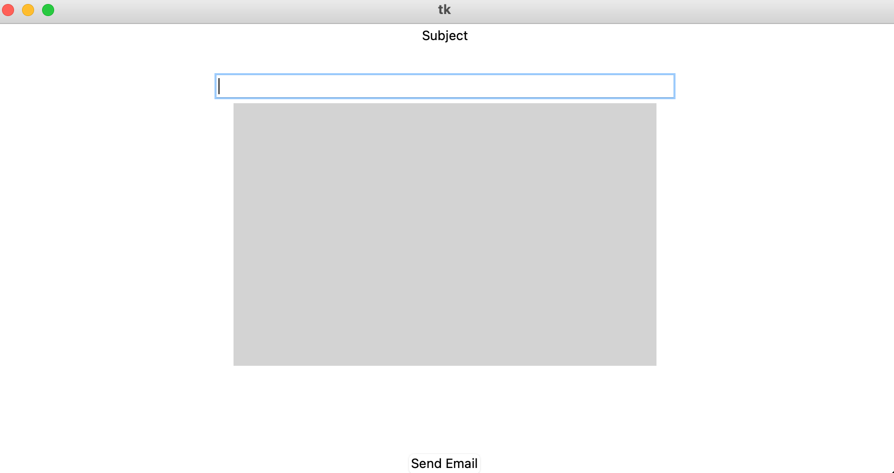
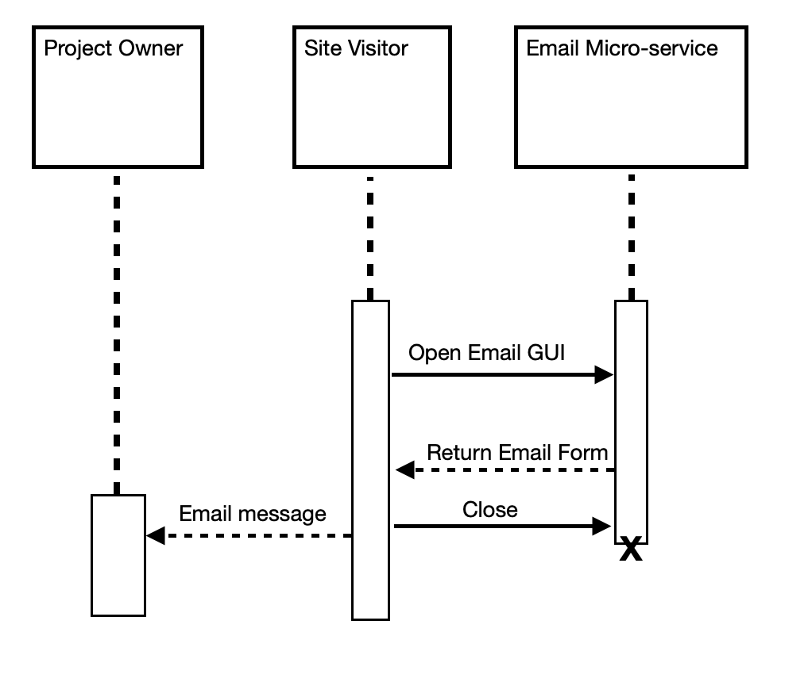

<div id="top"></div>

<br />
<div align="center">
  <a href="https://github.com/Jacob-Heinrich/email-microservice">
  </a>

</div>

## About The Microservice




### Built With

* [Python](https://www.python.org)
* [RabbitMQ](https://www.rabbitmq.com)
* [Tkinter](https://docs.python.org/3/library/tkinter.html)


## Running the service


### Prerequisites

* Install RabbitMQ
  ```sh
  brew update
  brew install rabbitmq
  ```

### Starting RabbitMQ server

1. Start Server
   ```sh
   brew services start rabbitmq
   ```
   
### Start microservice
1. Start Service in terminal
    ```sh
    python3 emailMicroservice.py
    ```

### Send Request to microservice
1. Send request with 
    ```sh
    channel.queue_declare(queue='email')
    channel.basic_publish(exchange='', routing_key='email', body='yes')
    ```

### Request data
    Users can request data by sending a message to the microservice 
    to open up the email gui. There users will be able to compose an email 
    with a body and a subject. Once the submit button is clicked, the email will be 
    sent to the corresponding email.

### Receive Data
    Data will be received by the email service sent to the corresponding email.
    Once the user clicks send, that message will be send directly to the email.


### UML Sequence Diagram


<p align="right">(<a href="#top">back to top</a>)</p>


